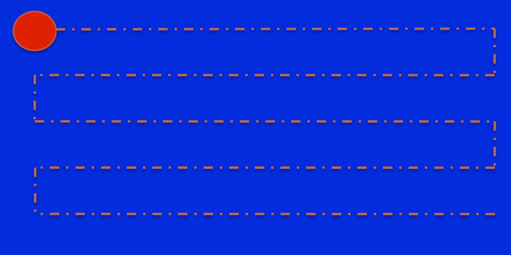
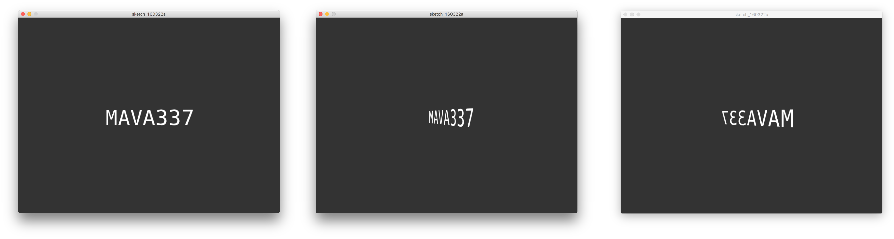
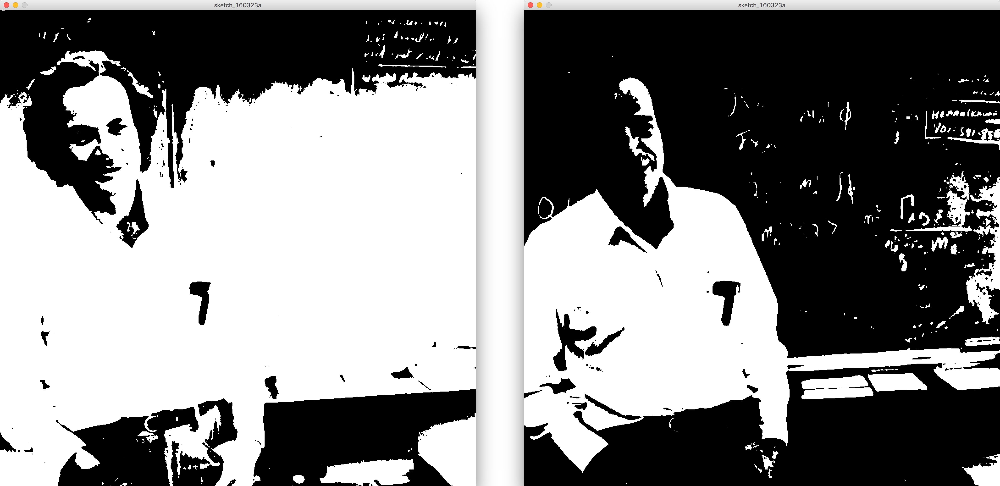

### MAVA 337 Introduction to Programming for Design  (2016 Spring)

# Assignment 2: Processing

This homework assignment concludes our coverage of the second programming language you learn through this course: Processing. We will collect and grade your work. The grading rubric is given below.

The lectures, lecture slides, and labs should cover all of the information that you need to complete this assignment. Feel free to consult any course materials or outside sources. Feel free to use code you have written before.

> You will notice there are a lot of technical terms in the instructions. This is intentional. Most of what programmers do today is piecing together bits and pieces of code they find online. To find these bits and pieces, you need to search for the right keywords. You want to know the language of programming, not a particular programming language.

### Academic Honesty

You are expected to observe the code of academic honesty that is included in the course syllabus. Please don't copy each other's work. We will know if you do. However, we will not be able to know who supplied the code and who copied it, so both parties will suffer if we detect cheating.

Remember that you can rely on any resources, including any sinippets code you find online. If you use other people's code, *put a comment in your code which says where you got the snippet from (provide a link), and what exactly it does*.

### Submission Instructions

There are four parts to the assignment. For each part, create a new Processing project with its own directory. Call them `PathFollower`, `RotatingText`, `Textures`, and `ImageThresholding`. Put all four project directories inside a directory called `2_Processing_YourName`. Compress it into a `.zip` file with the same name. E-mail it to the instructor and the TA (see the syllabus for the contact information).

Due 23:59 on April 6, 2016.

### Grading Rubric

- Working code for Part 1: 5 points
- Working code for Part 2: 4 points
- Working code for Part 3: 5 points
- Working code for Part 4: 5 points
- Comments on classes, methods, and reasonable chunks of code explaining what they do: 2 points
- Properly indented code: 2 points
- Observing naming conventions (same as Java for function, variable, class, etc. names): 2 points

These add up to 25 points, which represents 25% of your final grade from this course.

#### Bonus points:

We will not be automatically checking your work for these. If you have put in the effort to get these bonus points, please tell us in the e-mail as you submit your work.

### 1) Path Follower

Draw the circle shown below on the canvas. Make the circle follow the path. You don't have to draw the path itself.

Basically the circle should begin from the top left corner of the screen, travel to the right, move down when it hits the edge, move to the left edge again, move down, and repeat. The animation can be as fast or as slow as you want, but we should be able to observe the circle move (not too fast!). Also, the vertical and horizontal movement must occur at the same speed.. When you arrive at the bottom corner, do whatever you want (stop, loop, make the circle explode and scatter confetti...)

You can implement this in reasonably few lines of code using some basic, garden variety [`if` statements](https://processing.org/reference/if.html), [`for` loops](https://processing.org/reference/for.html), etc.

Remember that you can access the canvas dimensions using the [`width`](https://processing.org/reference/width.html) and [`height`](https://processing.org/reference/height.html) system variables.

You must specify some colors for the [background](https://processing.org/reference/background_.html) and the [circle](https://processing.org/reference/fill_.html); but they don't have to be the colors shown. Feel free to use different colors.

Hint: You can use the [`PShape` class](https://processing.org/reference/PShape.html) and its [`translate()` method](https://processing.org/reference/PShape_translate_.html) to move the circle around. You can also use the [static `translate()` function](https://processing.org/reference/translate_.html) which moves the whole coordinate system around.

### 2) Rotating Text

Write "MAVA337" in a [monospaced font](https://en.wikipedia.org/wiki/Monospaced_font) right in the middle of the screen and rotate it around the y-axis.

Hints:

- Before you pick the font for your text (with [`createFont()`](https://processing.org/reference/createFont_.html)), use the [`Pfont.list()`](https://processing.org/reference/PFont_list_.html) function to obtain a list of the fonts available on your system.
- You may want to use the [`textAlign()` function](https://processing.org/reference/textAlign_.html).
- If you use the parameters for the [`text()`](https://processing.org/reference/text_.html) function to set the position of your text, the text will rotate around an axis that is located off the text. Use [`translate()`]((https://processing.org/reference/translate_.html)) instead, to revolve the text around the middle.
- You will need to use a global variable for the rotation angle.
 
> The code we wrote to produce the example screenshots below is 22 lines, of which 6 contain only spaces or curly brackets. Around 15-20 instructions should be enough to finish this exercise if you study the documentation and use the functions etc. we suggest above.

### 3) Textures

Take a look at [this video](https://www.dropbox.com/s/dw370cn1us7gmc3/Planets.mov?dl=0). Follow the instructions to build something very similar.

Use Processing's [P3D render mode.](https://processing.org/tutorials/p3d/)

Use the [`shapeMode()` function](https://processing.org/reference/shapeMode_.html) to draw shapes from their center.

We used a canvas size of 800x600 pixels. The recommendations for dimensions below will be for this canvas size. However, feel free to experiment with other values for dimensions and animations.

Find an image depicting space and set this as your background. Use the [`PImage` class](https://processing.org/reference/PImage.html) and the [`loadImage()` function](https://processing.org/reference/loadImage_.html).

Find images depicting fire, water, and soil. [Draw three spheres](https://processing.org/reference/createShape_.html), 50 pixels in radius. [Apply the images onto the spheres as textures](https://processing.org/tutorials/p3d/). [Turn off the stroke](https://processing.org/reference/PShape_setStroke_.html) on the spheres.

Use a global variable called `rotator` of type `Float` that initializes at 0. Increment it by 1 at the end of each `draw()` iteration. [Rotate the whole coordinate system around the Z-axis](https://processing.org/reference/rotateZ_.html) by 1/100th of the value of `rotator`. (Or increment it by 0.01 on each iteration, and don't worry about the calculation.) Do this after you set the background and lights, *before* you draw the spheres.

Initially, place the shapes at (X,Y) coordinate pairs (100, 100), (-100, 100), and (-100, -100).

Rotate all three spheres around their own center by small values. We used the `rotateX()`, `rotateY()`, and `rotateZ()` functions and just randomly gave values around 0.01.
 
> The code we wrote to produce the example video is 65 lines, of which 20 contain only spaces or curly brackets. Around 40-50 instructions should be enough to finish this part if you study the documentation and use the functions etc. we suggest above. The reason why this part requires more code than the others is that there are 3 objects to move, rather than 1. Many instructions are repeated 3 times, for the 3 spheres.

> Use the "usage rights" filter in Google Images to find images that is appropriate for "reuse with modification." (In general this is a good habit for when you need a few quick images for a project.)

### 4) Image Thresholding

Grab Richard Feynman's photo from below.

Traverse the image pixel by pixel and apply a thresholding effect.

Some tips:

- You will need to use the [`PImage` class](https://processing.org/reference/PImage.html).
- You probably don't need to write a `draw()` function, you can handle everything within `setup()`.
- Check the dimensions of the original image. Set your canvas size to those dimensions.
- We used the HSB [color mode](https://processing.org/reference/colorMode_.html). In HSB, you can represent the [color](https://processing.org/reference/color_.html) white as `(0, 0, 255)` and black as `(0, 0, 0)`.
- Most probably you will need to read the documentation and use the following: The [`loadPixels()` function](https://processing.org/reference/loadPixels_.html), the [`pixels` array](https://processing.org/reference/pixels.html), the [`brightness()` function](https://processing.org/reference/brightness_.html), and the [`color()` function](https://processing.org/reference/color_.html).

> The code we wrote to produce the examples below is 28 lines, of which 11 contain only spaces or curly brackets. Around 15-20 instructions should be enough to finish this part if you study the documentation and use the functions etc. we suggest above.

Below are two examples we have done. The image on the left, with more white than black, is the result of using a brightness threshold of 100. The image on the right, which is darker, was produced with a brightness threshold at 200.

