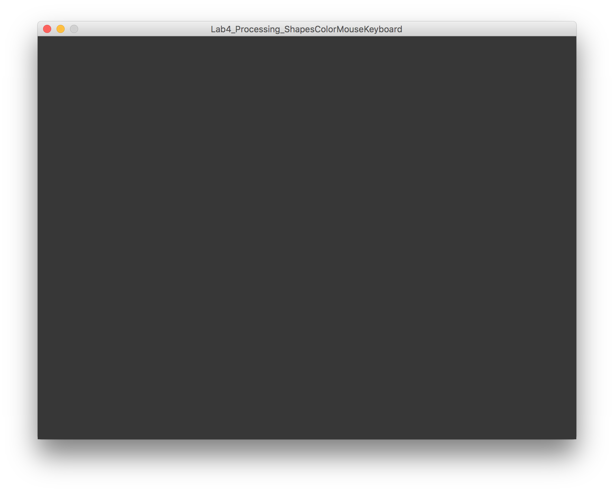
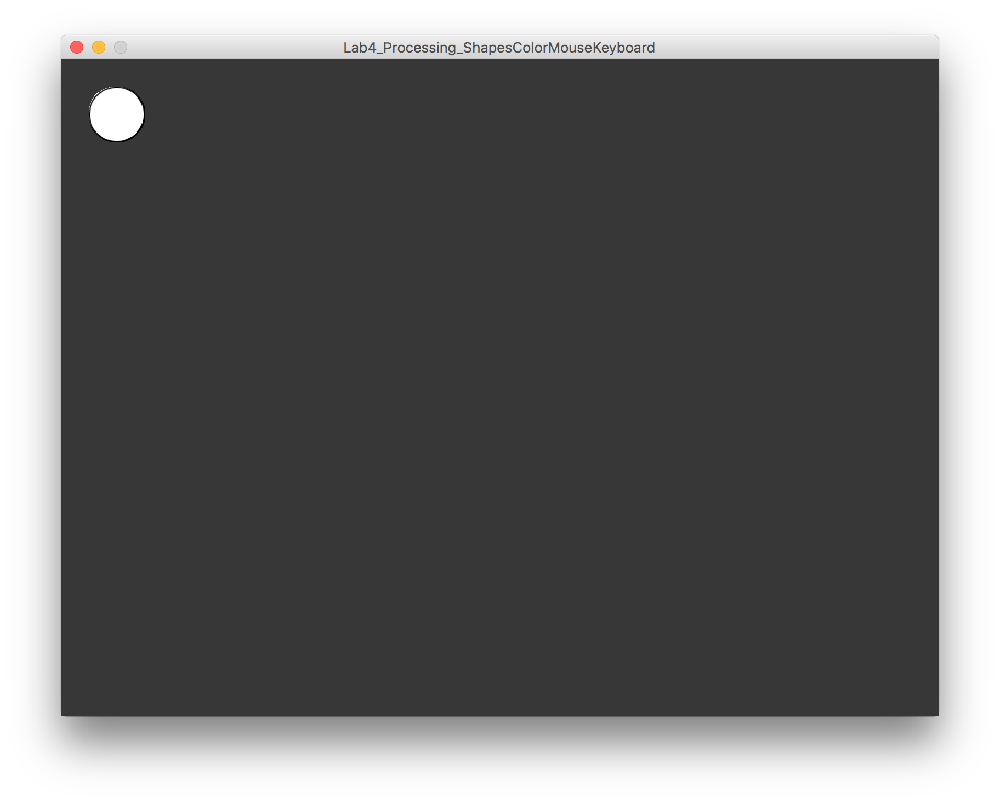
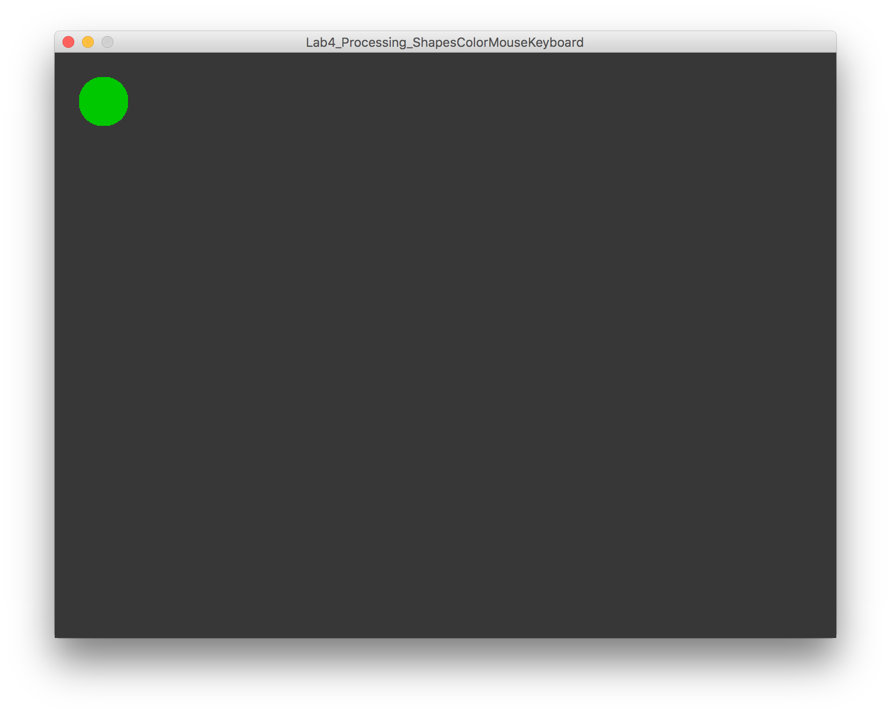
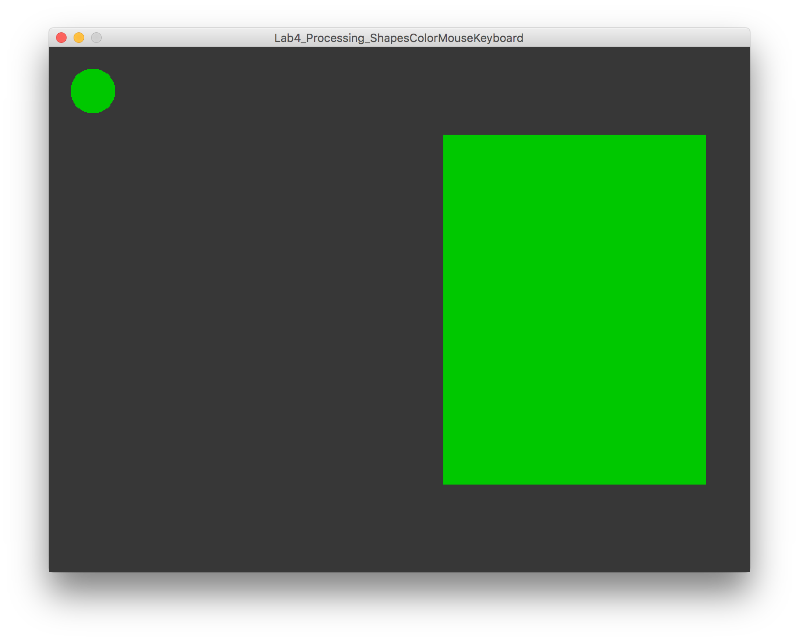
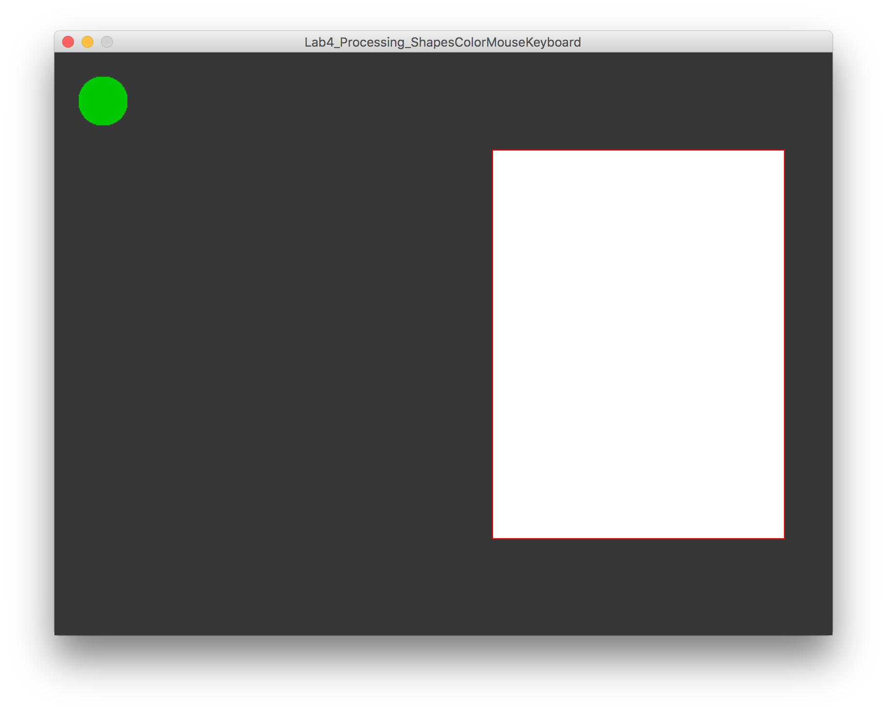
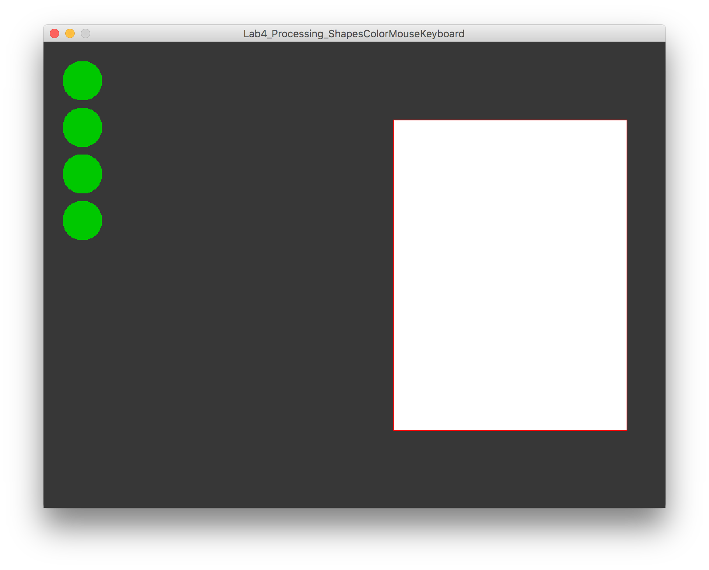
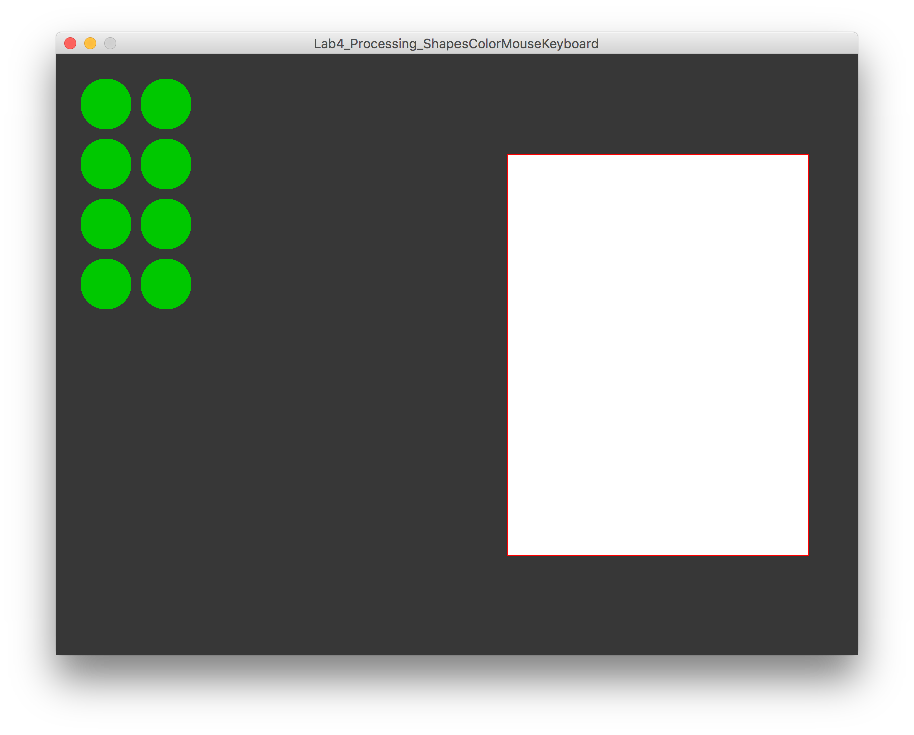
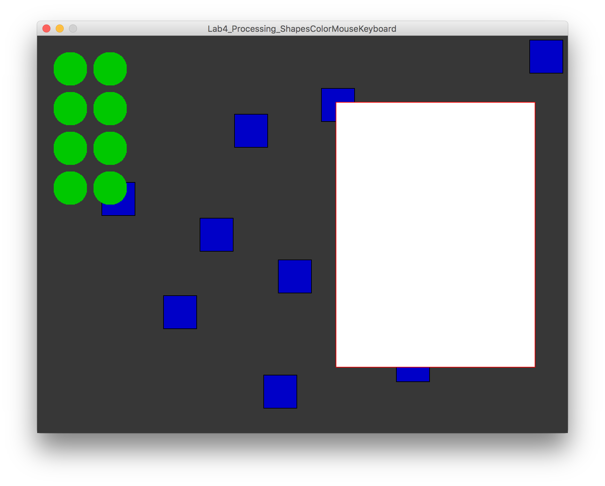
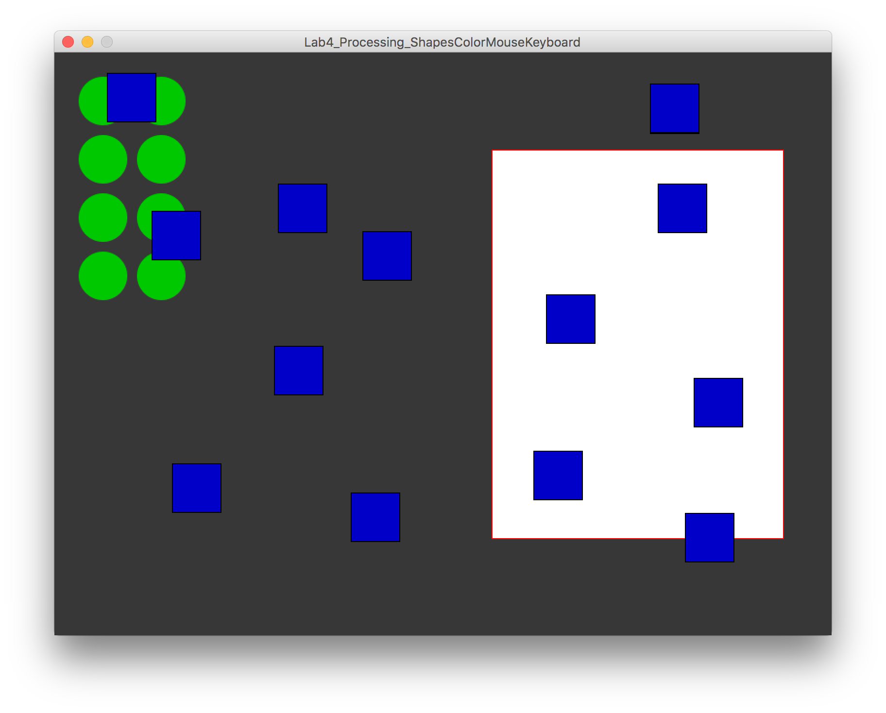
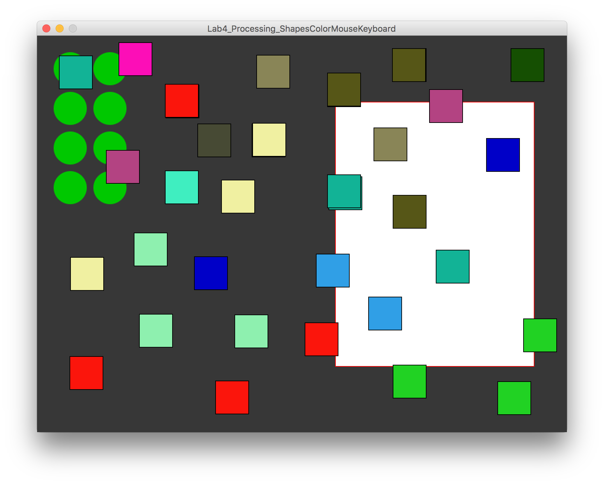

### MAVA 337 Introduction to Programming for Design  (2016 Spring)

# Lab 4: Shapes, Color & Basic Interactivity in Processing

This lab relates to the first lecture on Processing, where shapes, colors, and interactivity through the mouse and the keyboard were covered, in addition to the basics of Processing. After this lab, you should be comfortable with these terms: **function**, **draw()**, **setup()**, **canvas**, **stroke**, **fill**, **coordinate system**, **color model** (e.g. RGB, CMYK...),

## Scenario

Today we're just going to practice putting some shapes on the screen and coloring them in. We will also see how the programming skills you learnefd previously with Java translate to Processing.

### 1) Setting Up Processing

We are hoping that you already have Processing up and running on your computer. If not, please go to [processing.org](http://www.processing.org) now to download the latest version of Processing for your operating system, and install it on your computer.

### 2) The Canvas

Let's set up our "canvas" first.

- Declare your `setup()` **function**.
- Set up a canvas of size 800x600 pixels, filled with a dark grey background. (Use the `size()` and `background()` functions inside the `setup()` function.)
- Run your code. You should see the following:

Notice that, essentially, what we call **methods** in Java are called **functions** in Processing.

> Refer to the [Reference](https://processing.org/reference/) section on the Processing website to see what features are available in the language and how they can be used. For examples, go to that page and look up the `background()` function now.

### 3) Basic Shapes

In Processing, the `draw()` function often comprises the main functionality of your code. `draw()` is essentially equivalent to a `while(true)` loop that loops forever; executing everything inside of it repeatedly. Variables etc. persist across iterations of the `draw()` function; i.e. values of variables are not reset when one iteration of the loop is over, they carry on to the next one (unless you explicitly reset them in your code). In contrast, the contents of the `setup()` function are executed only once, when your program begins to run.

- Declare you `draw()` function.

Now let's put a circle on the screen. A circle is essentially an ellipse with equal height and width.

- Use the [`ellipse()`](https://processing.org/reference/ellipse_.html) function to draw a circle, 50 pixels in diameter, onto your canvas. The center of this ellipse should lie on coordinates (50,50).
- Run your code. You should see the following:

Now let's **fill** the circle with green color. We had a hard time deciding on the color of its **stroke**, so we'll go with no stroke.

- Use the `fill()` function to make the circle green.
- Use the `noStroke()` function to kill the circle's stroke.
- Run your code. You should see the following:

> Notice that you need to put these "modifier" functions before the line of code that creates the shape. For more info on  *exactly* how they work, check out the documentation. For example, the [documentation for the `fill()` function states](https://processing.org/reference/fill_.html): *Sets the color used to fill shapes. For example, if you run fill(204, 102, 0), all subsequent shapes will be filled with orange. This color is either specified in terms of the RGB or HSB color depending on the current colorMode(). The default color space is RGB, with each value in the range from 0 to 255.*

Our circle is looking a bit lonely, so we'll add a rectangle to our canvas.

- Use the `rect()` function to draw a rectangle of height 400 and width 300 on the right side of the canvas (x>400).
- Compile and run your code. You should see something like the following:

This is a rather radical amount of green. Let's have a white rectangle with a red stroke.

- Use the `fill()` function to make the inside of the rectangle white.
- Use the `stroke()` function to give the rectangle a red stroke.
- Run your code. You should see something like the following:

### 4) Multiple Shapes

We will now use a `for` loop to have an array of circles, instead of one.

- Go back to your line of code that draws a circle. Wrap it inside a blank for loop.
- Write the **init**, **test**, and **update** statements in the for loop to initialize a counter (named `i`) at 0, increment it by 1 on every iteration, and stop before it reaches 4.
- If you run the code now, you will only see one circle on the canvas. This is because you are drawing all four of your circles on exactly the same spot. Edit the y-coordinate parameter of the `ellipse()` function to have it move down by 60 pixels on every iteration of the for loop.
- Run your code. You should see something like the following:

Now we have one column of 4 circles. Lets have two columns!

- Copy and paste the entire for loop that generates the first column of circles.
- Edit the inside of the second for loop so that the center points of the circles in the second column lie 110 pixels to the right of the left border of the canvas.
- Run your code. You should see something like the following:

### 5) Creating Shapes via Mouse

Now we'll empower ourselves with the ability to create little rectangles with mouse clicks.

- Write an `if` statement that checks for left button mouse clicks. Use the `mousePressed` and `mouseButton` variables.
- Before the if statement, we'll add the following line of code, which alters how the `rect()` function works: `rectMode(CENTER);`
- After the if statement, we'll add another line that restores how the `rect()` function works to its normal state: `rectMode(CORNER);`
- Inside the if statement, use the `rectangle()` function to create a square, 50 pixels in height and width, centered on where the mouse cursor is. Use the `mouseX` and `mouseY` variables to retrieve the coordinates of the cursor. Refer to the [documentation on the `rectmode()` function](https://processing.org/reference/rectMode_.html) to figure out how to draw the rectangle.
- Make these squares blue, with a black stroke.
- Run your code and click around on the canvas with the left mouse button. You should see something like the following:

### 6)`draw()` vs. `setup()` Revisited

Notice how your new squares appear behind the previously drawn circles and big white rectangle. This has to do with how the `draw()` function works. The contents of this function are looped over and over; so a new iteration of the `draw()` function comes draws everything over the previous contents of the canvas continuously.

To have our circles and rectangle appear behind the newly created squares, we have to move the code that creates them into the `setup()` function.

- "Cut" the code that has to do with the 8 little green circles and the big white rectangle. "Paste" this code into the `setup()` function.
- Run your program and observe the difference:

### 7) Keyboard Interactions and Changing Color

Finally, we'll use the keyboard to change the color of our little squares that we've been placing on the canvas with mouse clicks. We will move out of the `draw()` loop and use the `keyPressed()` method for this.

- Declare the `keyPressed()` method in your code, below the `draw()` function.
- Inside the `keyPressed()` method, write a line of code that calls the `fill()` function and assigns a random color to the fill. Since the `random()` function was not covered in the lecture, we'll just give you the line of code you should put in there: `fill(random(255), random(255), random(255));`

> `random(255)` returns a random integer between 0 and 255. Check out the [documentation for the `random()` function](https://processing.org/reference/random_.html) for more info.

> The [documentation on color mode](https://processing.org/reference/colorMode_.html) is also interesting.

- Compile and run your code. Click the canvas to draw a square. Press a key to change the color. Click the canvas to draw another square. Notice that the color has not changed. Try and fail a few more times. Contemplate why your new squares are not being drawn with a randomly colored fill. Solve the problem yourself. (Hint: See section 6 of this lab.)

Here's a final screenshot to keep you motivated:

> Notice how we haven't instructed you to put in any comments in your code. While we will no longer explicitly ask for comments in the lab instructions, we will be expecting you to properly comment the code that you submit for grading later. It is also a good idea to label chunks of code with comments that remind you about its functionality.

### (Bonus Material)

- [Recreating Vintage Computer Art with Processing](https://youtu.be/LaarVR1AOvs) by Alexander Miller on YouTube
- [Tutorials on processing.org](https://processing.org/tutorials/)
- [Examples on processing.org](https://processing.org/examples/)
- [Exhibition on processing.org](https://processing.org/exhibition/)
- [Language Reference on processing.org](https://processing.org/reference/)
