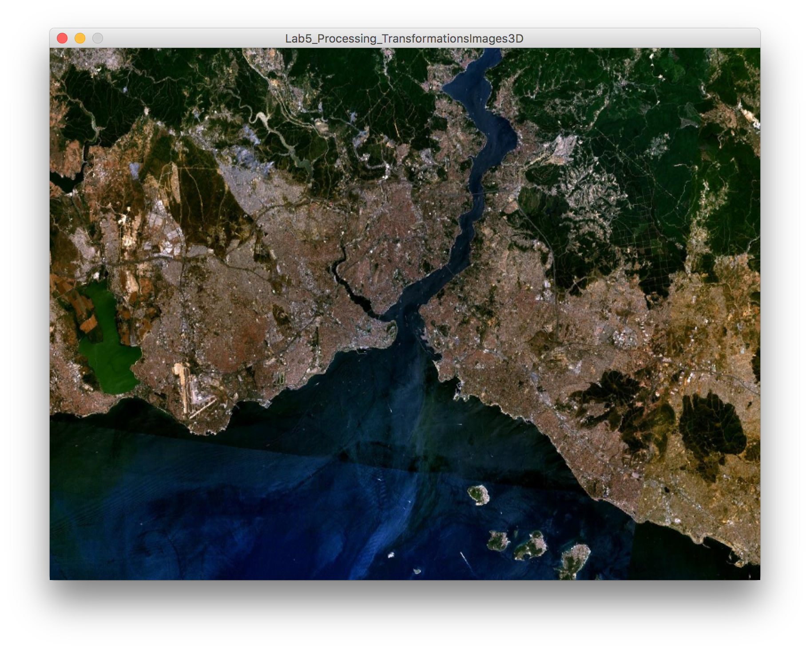
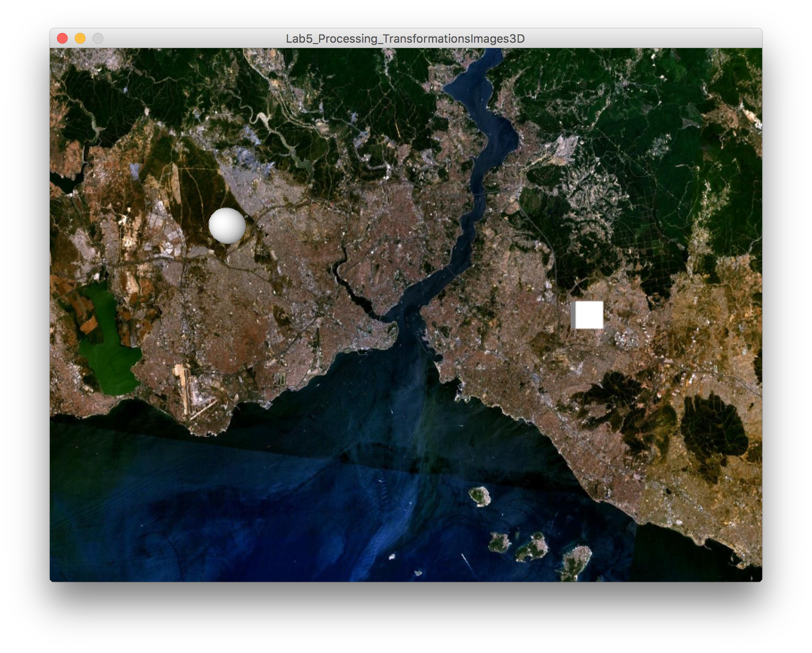
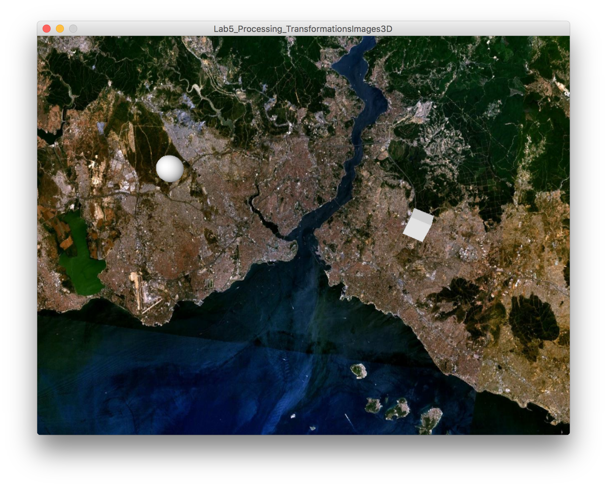
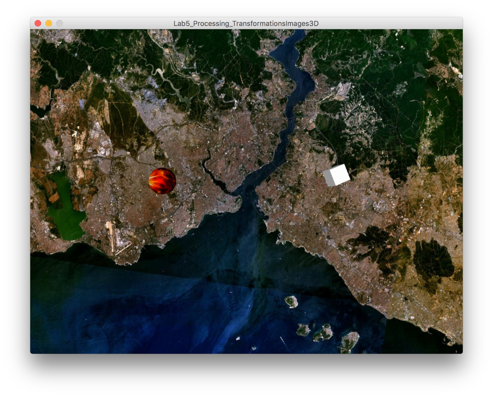

### MAVA 337 Introduction to Programming for Design  (2016 Spring)

# Lab 4: Transformations, Images, Textures and 3D in Processing

This lab relates to the second lecture on Processing, where transformations, images, textures, and 3D graphics were covered. After this lab, you should be comfortable with these terms: **rendering**, **coordinate system**, **translation**, **rotation**, **scaling**, **filter**, **pixel**, **texture**, **polygon**.

## Scenario

Today we'll be working on the beginnings of a game where the player combatste evil spheres, cubes, and other abstract geometric shapes from outer space that are attacking earth.

### 1) Images

Let's load up a background image first.

- Set up a canvas of size 800x600 **pixels**. Use the P3D **renderer**.
 
> Check out the [tutorial for P3D on the Processing website](https://processing.org/tutorials/p3d/) for detailed info about different renderers, why you would use them, how to use them, etc.

- Declare the `PImage` variable that will hold your image file as a global variable, before the `setup()` function.
- Use [Google Images](https://images.google.com/) to find a satellite map image of a place you like. Make sure this image is larger than 800x600 pixels and comes with the appropriate usage rights. You can also just download the `map.jpg` file in this repository.
- Put the image inside your Processing sketch folder.
- Load the image inside your `setup()` function using the `loadImage()` function.
- **Resize** (**scale**) the image to be exactly 800 pixels in width and 600 pixels in height.
- Use the `image()` function to put the image on your canvas. You can also use the `background()` function for this. The choice is yours.
 
> [This tutorial](https://processing.org/examples/backgroundimage.html) demonstrates how to load a background image, using the `background()` function.

Now you should be seeing your background image loaded up on the screen, when you run your code:

### 2) Creating Shapes

Let's draw some enemies!

- We need to do some setup first: in your `draw()` function, use the `noStroke()` command to prevent Processing from drawing lines around each **polygon**.
- In `draw()`, use the `lights()` command to initialize some default lights.
- Use the `translate()` function to set the point where you will be inserting the first enemy. Use the coordinates `(200, 200, 0)`.

Notice that **translation** here is used in the same way that you might use it in a physics or mechanics class. It denotes a kind of motion where a "body" is moved in one direction in its entirety, without any rotation.

- Use the `sphere()` function to generate a sphere of radius 20. This is our enemy #1, the evil alien sphere.
- Use the `translate()` function again to set the point where you will be inserting the second enemy. Make the second enemy appear at coordinates `(600, 300, 0)`.

Notice that the [`translate()` function operates cumulatively](https://processing.org/reference/translate_.html), so the command `translate(600, 300 ,0);` will place the second enemy outside of the canvas. You need to figure out the *difference* between coordinates and use that.

- Use the `box()` function to generate a cube, 30 pixels long on each side(the second enemy).

Run your code to verify that you are able to see a sphere and a cube on your screen:

> Try running your code with the `noStroke()` commented out to see their effects. Also try commenting out `lights()`.

Now that we have managed to produce the evil abstract geometric shapes from outer space, we can work on moving them around.

### 3) Moving Shapes, Pt. 1/2

The first method we will use to move shapes around the screen involves the `pushMatrix()` and `popMatrix()` functions. We'll use this method to move the cube around.

It is quite important that you realize this: When we move things around in this fashion, calling functions like `translate()` or `rotate()`, we are manipulating the **coordinate system**, not the shapes themselves.

We enclose the commands for applying transformations within `pushMatrix()` and `popMatrix()`, so that they are not added up to the global transformations that determine where the other objects will be located. The [tutorial on 2D Transformations on the Processing website](https://www.processing.org/tutorials/transform2d/) explains the details of this very well.

We want the cube to exhibit small amounts of random motion. For this, we need to generate small random numbers that will specify the amount of translation and rotation that our shapes will undergo. We also need some global variables to store the position of the **coordinate system** that relates to the cube.

- Declare six global variables of type `float` called `cubeX`, `cubeY`, `cubeZ`, `cubeRotX`, `cubeRotY`, `cubeRotZ`.
- Upon declaration, initialize `cubeX`to 600, `cubeY` to 300, and `cubeZ` to 0.
- In `draw()`, declare and intialize three random `float`s between -5 and 5 called `cubeTransX` and `cubeTransY`. (Hint: use  `random(-5, 5);`)
- Declare and initialize a random `float` between -1 and 1 called `cubeTransZ`.

Now we have variables we'll use to store the magnitudes of the transformations we'll apply to our cube. Let's put them in action.

- In `draw()`, after you generate three random variables that will determine the amount of motion for the cube, increment the variables `cubeX`, `cubeY` and `cubeZ` by the appropriate random numbers.
- Increment `cubeRotX`, `cubeRotY` and `cubeRotZ` each by 0.1.
- For now, delete the `translate()` function that determines the location of the sphere.
- Move the `box()` function *before* where you set the location of the sphere and generate it.
- Wrap the `box()` function that generates the cube with `pushMatrix()` and `popMatrix()` functions. Refer to the lecture notes and Processing documentation to understand what these do in detail.
- Use the `translate()` function after `pushMatrix()`, and before the `box()` command, to set the new location of the cube. Use the new, incremented `cubeX`, `cubeY` and `cubeZ` coordinates to determine the amount of translation in each axis.

> All of these new features and functions (PShape, createShape, lights, etc.) may confuse you when you encounter them for the first time. To avoid confusion, whenever you encounter a new term that you haven't seen before, just look it up in the documentation. The [Reference](https://processing.org/reference/) section on Processing's website covers all of the features in the language. Here, you can find very detailed explanations on how functions like [PShape()](https://processing.org/reference/PShape.html), [createShape()](https://processing.org/reference/createShape_.html), [lights()](https://processing.org/reference/lights_.html), [translate()](https://processing.org/reference/translate_.html), etc. work. This is how professional computer programmers do their work. Compared to actually typing in code, programmers spend a lot more time looking at documentation and online communities (e.g. [Stack Overflow](http://stackoverflow.com/)).

- Run your code to see that our little evil alien box is moving around in 3D space, while the sphere is stationary:

### 4) Moving Shapes, Pt. 2/2

To make our little evil alien sphere move around the screen, we'll write our code a little differently. We need to declare a global variable to store information about the shape, create it during `setup()`, and work with some new functions.

First, in `draw()`:

- Delete or comment out the line of code where you translated the drawing reference point to (250, 250, 0).
- Delete or comment out the line of code where you draw a sphere.

Then, in `setup()`:

- Declare a global variable of type `PShape` called `enemySphere`.
- In `setup()`, use the `createShape()` function to initialize a sphere, 25 pixels in radius.
- Use the `setStroke()` function on `enemySphere` to kill of the stroke around the sphere's polygons.

Finally, we're back to `draw()` again.

- Declare and intialize three random `float`s between -1 and 1 called `sphereTransX` and `sphereTransY`. Declare and initialize a random `float` between -1 and 1 called `sphereTransZ`.
- Use the `shape()` function to place `enemySphere` onto your canvas, located at (250, 250).
- Use the `translate()` function on the `enemySphare` object to move it by the amound specified by the `sphereTransX`, `sphereTransY` and `sphereTransZ` variables.
- Use the `rotateX()` function on the `enemySphere` to rotate it.

Now you should see both of the enemy objects moving around randomly. Play around with the numbers to achieve the quality of animation you like. If you wish to constrain the random motion in any way, you can add some if statements.

### 5) Textures

Our enemy shapes are looking a little bland. Let's apply some **textures** to the geometric shapes to finish off for today.

- Use [Google Images](https://images.google.com/) to find a texture you like. Make sure this image comes with the appropriate usage rights. You can also just download the `evilAlienRed.jpg` file in this repository.
- Declare a global variable called `alienImg` of type `PImage`.
- In `setup()`, load the image.
- In `setup()`, use the `setTexture()` function on `enemySphere` to apply the texture to the sphere.

Run your code to verify that the texture is applied to the sphere:

