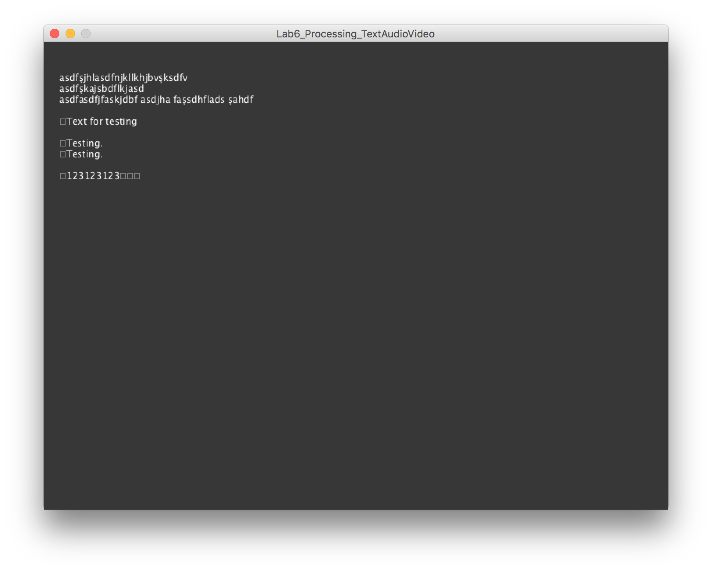
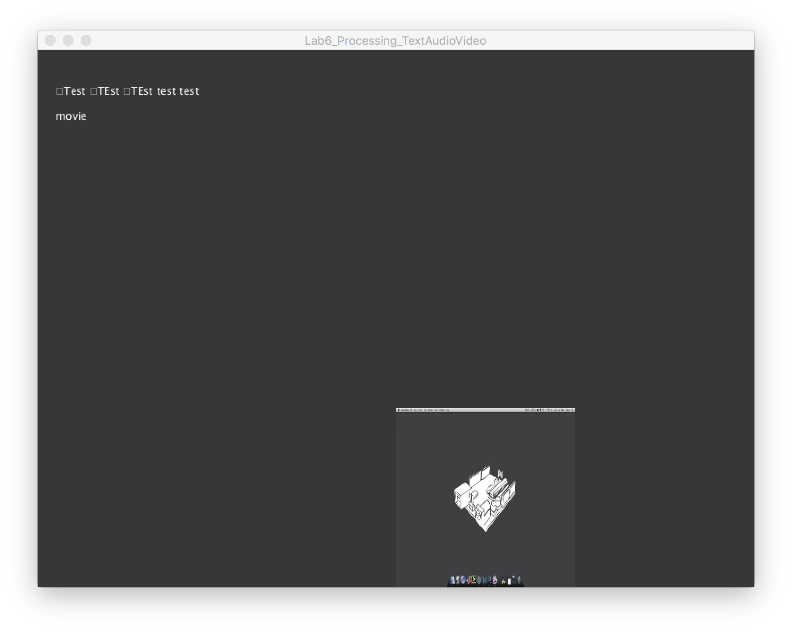

### MAVA 337 Introduction to Programming for Design  (2016 Spring)

# Lab 6: Text, Sound & Video in Processing

This lab relates to the final lecture on Processing, where various aspects of text, sound, and video were covered.

## Scenario

Today we'll be working on an application that responds to your typing on a keyboard. The program will be "listening" to what you are typing and play sounds or videos when specific commands are typed.

### 1) Setup

- Set up a canvas of size 800x600 pixels.
- Give the canvas a dark grey background.

### 2) Text

To put text on the screen, we have to load a font first. In `setup()`:

- Declare and initialize your font. Use a variable of type `PFont` and use the `createFont()` function to choose which font you are going to use, and which size.

As shown on the lecture slides, you can use the `PFont.list()` function to see a list of the fonts on your computer that you can choose from.

Instead of displaying static chunks of text, we want to show the letters typed on the keyboard by the user. We'll follow the method shown on the lecture slides to accomplish this:

- Declare a global variable of type `String` called `letters`. Initialize this variable as an empy string ("").
- Move `background()` function call into the `draw()` function, if it is not already.

If we do not re-paint the background on every iteration, we'll have some ugly artifacts on the screen. Later, try commenting out the line where you paint the background and see for yourself.

- Use the `text()` function to display the value of `letters` on the screen. You'll need to specify the position of the text on the canvas by supplying the appropriate parameters to the `text()` function call. [Check out the documentation](https://processing.org/reference/text_.html) to figure out how.

Recall that we used the `keyPressed()` function to capture keyboard events. We will be using it again to listen to the keyboard and update the string on the screen.

- Declare the `keyPressed()` function. Make sure you place it *outside* the `setup()` and `draw()` functions.
- Write a blank if/else statement. We'll use this to capture and respond to the backspace key.
- Write the condition that checks if the backspace key is pressed. (Hint: Check if value of the `key` variable if equal to `BACKSPACE`.) (Hint 2: The lecture slides show how this is done.)
- Inside the if condition, where you respond to the backspace key, check if the length of the `letters` string is greater than 0. We don't need to do anything if there are no letters in the string anyway.
- If the length of the `letters` string is greater than 0 when the backspace key is pressed, update the string. The new value for `letters` should comprise a substring that includes all of the characters in `letters`, except for the very last one which is being deleted. (Hint: Again, this is the same method that is shown on the lecture slides.)
- Now go down to the `else` part of the outermost if/else statement, where we will handle keys other than backspace. Here, simply append the value of `key` to `letters`.

Run your code to see that it works. Any keys you press on the keyboard should be showing on the screen.

### 3) Sound

Now we will have our application respond to certain keywords by playing sounds. Specifically, we'll have our program play the contents of an audio file whenever we type the word "music".

- Import the contents of the sound library using the following statement at the beginning of your code: `import processing.sound.*;`
- Pick any sound file you like, and place it into your Processing project folder. If you can't decide, you can use the sound file in this repo.
- Declare a global variable of type `SoundFile` called `sf`.
- In `setup()`, initialize `sf` and load up your sound file. (Hint: use the `new` keyword.) (Hint 2: This is also on the lecture slides.)

Before we can actually work the code that loads a sound file, we need to add the sound file to our Processing project.

- Use the `Add File...` command in the `Sketch` menu to add your sound file to the project.

We'll put the rest of our code inside the `draw()` function. We'll check the last 5 characters that have been typed, and we'll play a soud if these characters form the word "music".

- Add an if statement to check that the **length** of `letters` is at least 5; i.e. there are at least 5 characters in the string.

Since we will be accessing the last 5 characters in the `letters` string, our code will fail if there are less than 5 characters in the string. This is why we need to check for the lenghth first.

- If `letters` contains at least 5 characters, inside the if statement, create a new `String` variable called `finalString` and assign to it the final 5 characters in `letters`. Use the [`substring()` function on `letters`](https://processing.org/reference/String_substring_.html) for this. Read the documentation for the function to understand how it works. (Hint: The ending index will be equal to the lenght of `letters`.  The beginning index will be 5 characters before the ending.)
- Nest a new if/else statement inside the if statement where you check for the lenght of `letters`.
- This inner if/else statement should check if the value of `finalString` is equal to "music". Use the [`equals()` function on `finalString`](https://processing.org/reference/String_equals_.html) to perform this comparison.
- If `finalString` is equal to "music", play the sound you loaded (`sf`). Use the `play()` function on the `SoundFile` object.
- If `finalString` is not equal to "music", stop playing the sound! Use the `stop()` function on the `SoundFile` object.

Run your program. Make sure that your sound plays when you type "music", and stops when the final 5 characters of the string you are typing are anything other than "music".

### 4) Video

Simiar to what we've done with audio, we'll listen to keyboard events to trigger viewing a video. But first, we need to set things up:

- Use the `Add File...` command in the `Sketch` menu to add your video file to the project.
- Import the contents of the video library using the following statement at the beginning of your code: `import processing.video.*;`
- Pick any video file you like, and place it into your Processing project folder. If you can't decide, you can use the video file in this repo.
- Declare a global variable of type `Movie` called `mv`.
- In `setup()`, initialize `mv` and load up your sound file. (Hint: use the `new` keyword.) (Hint 2: This is also on the lecture slides.)
- After you initialize your movie, use the following command to keep it playing in the background while we toggle its visibility: `mv.loop();`

We have already set up the if statement that checks the last few characters we type while the program is running. For now, we only respond to the keyword "music", by playing music. We'll program the application to respond to the keyword "video" too, by showing our video on screen.

- *Inside* the if statement that checks if `letters` has at least 5 characters, *after* the if statement that checks for the keyword "music" and plays or stops sounds, write another if statement. Here, check if the final 5 characters of `letters` are equal to the keyword "movie".
- If the keyword "movie" terminates `letters`, use the `image()` function to put the current frame from `mv` on the screen. Pick some coordinates and a size that won't obscure the text you are typing. See the [documentation for the `image()` function](https://processing.org/reference/image_.html) for a detailed explanation on how to control the size and placement.

Finally, we need to insert a `movieEvent` function at the very end of our code to advance the frames of our video. Just copy and paste the following lines at the very end of your code:

    void movieEvent(Movie m) {
      m.read();
    }

Run your code to see that it works. When you type in the word "video", the video should be showing on your screen. If you then type anything else, the movide will disappear.

